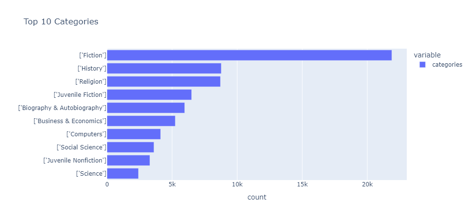
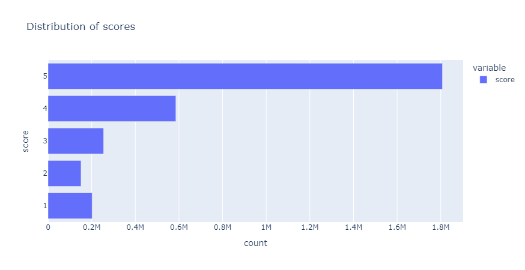
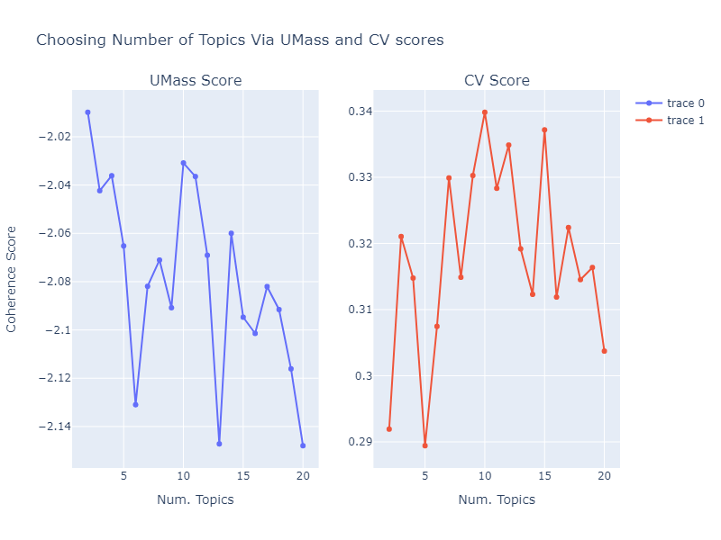
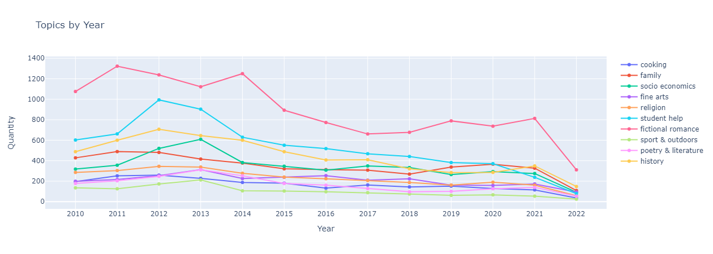
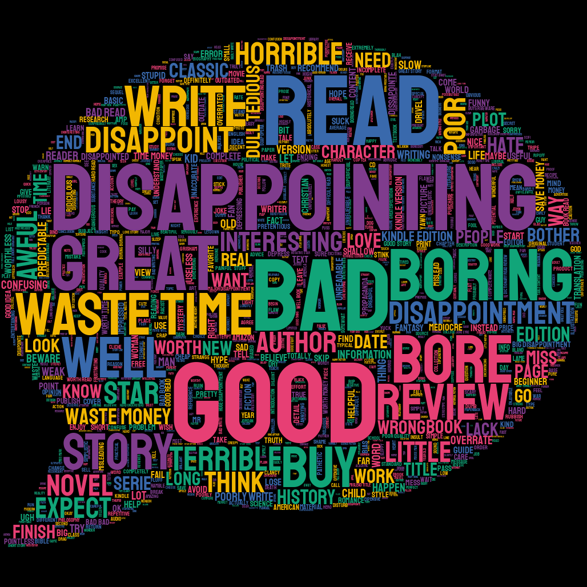
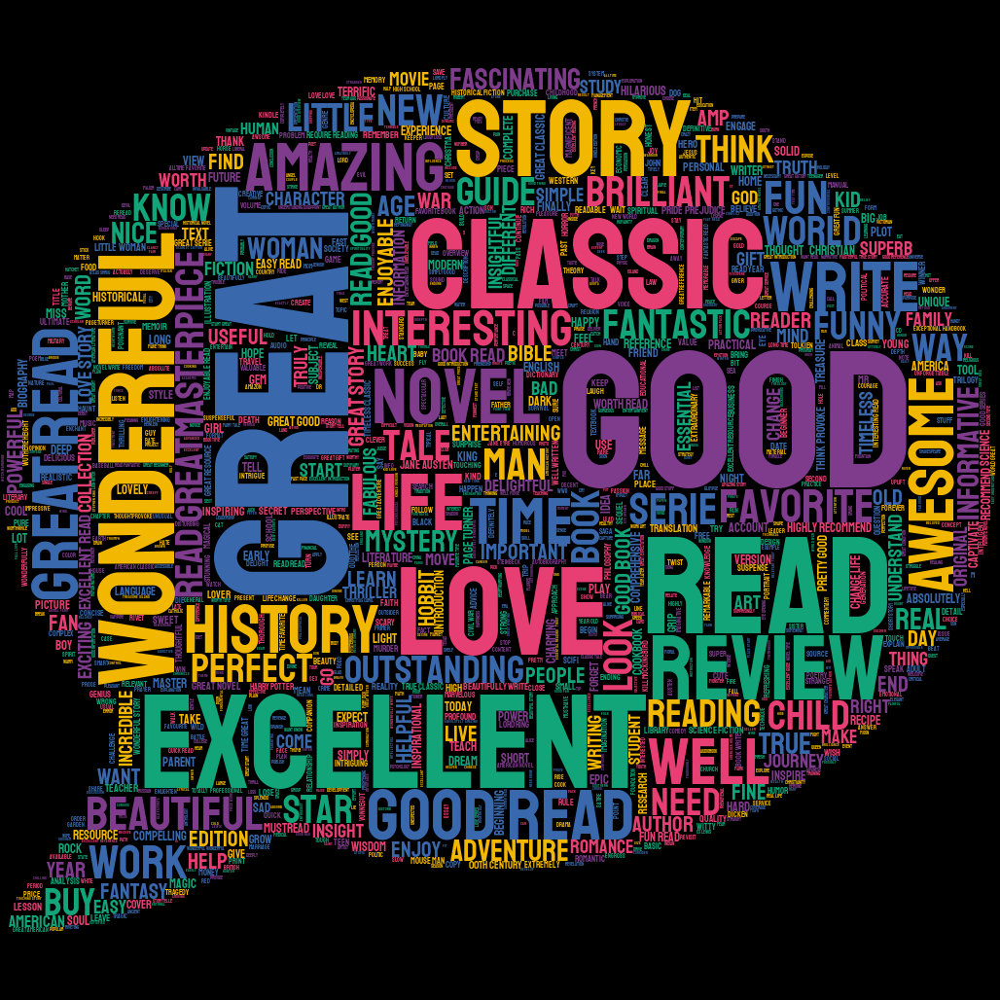
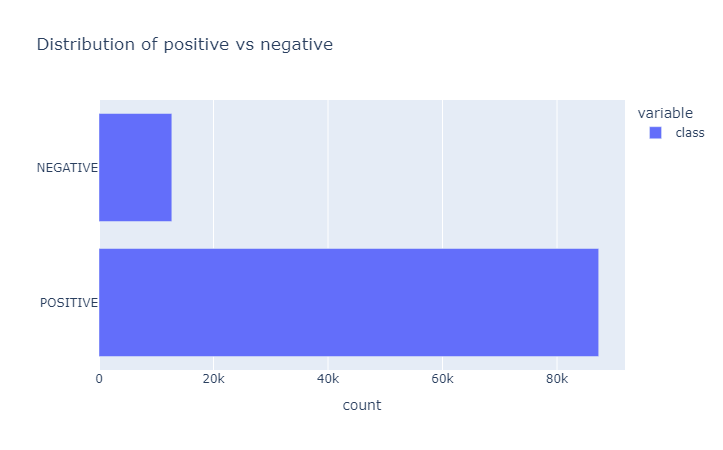
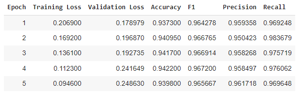
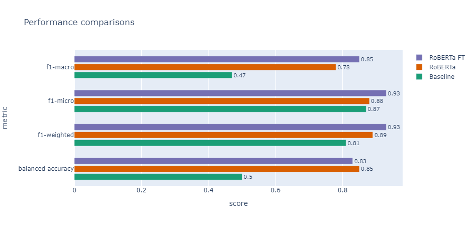

# Index
- [Problem Statement](#problem-statement)
- [Data Description](#data-description)
- [Assessment & Performance Indexes](#assessment-and-performance-indexes)
- [Topic Modeling](#topic-modeling)
- [Sentiment Analysis](#sentiment-analysis)
- [Results and Discussion][#results-and-discussion]

---
> # Problem Statement

The main aim of this project is to implement tools based on NLP techniques to be used for the following tasks:

1. Help publishers and authors understand the topics of books being sold on Amazon to have a better idea of the current interests and overall market situation.
2. Classify user reviews in order to incorporate this knowledge in a collaborative based filtering technique where similar tastes between users are used to recommend new items.   

To address these problems, we perform topic modeling and sentiment analysis on a corpus of book summaries and corresponding amazon reviews.

After studying the most frequent words in the corpus of book descriptions, we extract the K main topics that characterize books by means of LDA, along with the 10 most relevant words for each topic. Consequently, we try to interpret the theme of each topic and analyze their association to the categories provided in the dataset. Lastly, by using the topic distribution of each document, we study how the popularity of each theme changes over time.
    
For sentiment analysis, we initally use pretrained multilingual BERT to predict the score of the reviews from 1 to 5. Then we use RoBERTa to classify the reviews as positive and negative and compare them to grouped ground truth labels. Lastly, we fine tune RoBERTa using HuggingFace's Trainer environment to improve the model on our own data. We compare this model to a baseline dummy classifier which predicts the most frequent class. 

---
> # Data Description

The dataset contains two separate files with data on books and their reviews. 

The first file contains details about $\sim 212,000$ books. In particular, it contains information such as title, author, published date, description, and category. We immediately realized that around $68,000$ ($30\%$) items had a missing description, so they were eliminated since our main focus is to extract topics from the summaries of books. Furthermore, we realized later, not all the books were in English. Since LDA implicitly assumes the same language for document creation, we removed documents not in english after applying language recognition tools to the summaries. This left a total of $\sim 142,000$ items. In this subset, we study the frequency of the categories and find that the three most popular are fiction, history, and religion.

The second file contains information about $\sim 3$ million reviews on the books contained in the first file. In particular, we have info such as book id (being reviewed), title of the book, id of user reviewing, summary of the review, text of the review, and finally a score from 1 to 5. The scores are severly imbalanced with 5 star reviews being the most predominant class.

---
> # Assessment and Performance Indexes
With regard to parameter tuning, for topic modeling, LDA requires as input the number of topics $K$. To choose this value, we vary $K$ in $[2,...,20]$ and use two metrics: UMass and CV score. The optimal number of topics is reached when these two scores are locally maximized. However, we also keep in mind the principle of Occam's razor which prefers simpler, more explainable models, sometimes at the expense of a lower metric/score. 

On the other hand, for sentiment analysis, we use accuracy, precision, recall, and f1 score. In particular, we used sklearn's classification report to quicly obtain a per class score of the last three metrics as well as an overall accuracy of the model. In the end, when we compare the baseline with fine tuned RoBERTa, we use balanced accuracy, micro, macro, and weeighted f1 score. This is done to properly study the effect of class imbalance.

---
> # Topic Modeling
After having eliminated items with empty book descriptions and non english text, we are left with $\sim 142000$ elements. At this point, to obtain an even more descriptive summary of the book, we concatenate the title of the book at the end of the summary.

The we aggressively preprocess the text to reduce variance to a minimum and capture the most meaning with the word descriptors after running LDA. In particular, we normalize the text and remove all symbols and punctuations (except for hyphens and apostrophes), we tokenize using spacy, we keep the lemma of each word, we remove stop words contained in the default list of spacy, removing also words such as "book", "author", "write", "story". Finally, we find the joint collocations with PMI $\ge$ 1.0 and represent them as bigrams. This final bound was chosen to limit the computational power and keep only the most significative words. 

We construct the wordcloud from the preprocessed description to study the most frequent terms in order to have some prior ideas of some important topics/themes in the corpus. 

Some of the most frequent words are "work", "world", "life", "history", "time", "love", "family", are very suggestive of the topics present in the corpus. These are powerful indicators of possible topics that we may find in the corpus. Also, we can see that they can be linked in some way to the most popular categories shown before. 

After having prepared the corpus for LDA, we must determine the number of topics to extract. To achieve this, we loop over $K = [2,...,20]$ and train LDA on the first $10,0000$ documents, and compute UMass and CV scores on the next $40,000$. We set $\alpha = 0.01$ and $\eta = $"auto". The former tells us to expect around one topic per document while the latter is related to the specificy of words per topic and enabled LDA to learn a prior from the corpus. We obtain the following curves for varying $K$:

As we can see, we obtain that the the overall maximum is at $K=10$ topics for both UMass and CV score. 

Finally, we can extract the top 10 descriptors for each topics and examine the results.

|            |**Word 1**|**Word 2**|**Word 3**|**Word 4** |**Word 5**|**Word 6**|**Word 7**|**Word 8**|**Word 9**   |**Word 10**|
|----------- |----------|----------|----------|-----------|----------|----------|----------|----------|-------------|----------|
|**Topic 1** |recipe    |food      |guide     |cookbook   |cook      |garden    |plant     |dish      |cooking      |eat       |
|**Topic 2** |child     |life      |god       |love       |parent    |help      |dog       |little    |animal       |baby      |
|**Topic 3** |social    |theory    |political |study      |history   |science   |economic  |culture   |human        |american  |
|**Topic 4** |music     |art       |film      |work       |artist    |original  |include   |guide     |song         |history   |
|**Topic 5** |bible     |god       |church    |christian  |jesus     |testament |biblical  |spiritual |study        |christ    |
|**Topic 6** |student   |guide     |edition   |provide    |business  |design    |language  |include   |information  |system    |
|**Topic 7** |love      |novel     |man       |life       |find      |woman     |murder    |family    |young        |new       |
|**Topic 8** |game      |baseball  |sport     |guide      |player    |bird      |quilt     |include   |color        |history   |
|**Topic 9** |poem      |poetry    |poet      |litarature |work      |american  |history   |publish   |english      |essay     |
|**Topic 10**|war       |history   |american  |world      |life      |man       |america   |battle    |year         |new       |

As we can see, the topics are quite easy to interpret:
- topic 1: **cooking**
- topic 2: **family**.
- topic 3: **socio economic science**.
- topic 4: **fine arts**.
- topic 5: **religion**.
- topic 6: **student help**.
- topic 7: **fictional romance**.
- topic 8: **sport & outdoors**.
- topic 9: **poetry & literature**.
- topic 10: **history**.

We notice that some of these themes reconnect to the top 10 categories: **History**, **Religion**, **Juvenile Non-Fiction (student help)**, **social science & business/economics (socio economic science)**, **fictional romance** which could be relabeled to **juvenile fiction**.

Furthermore, we observe that some themes are new and others from the most popular categories are missing. For example, there is no presence of **cooking**, **sport & outdoors**, and **poetry & literature** in the most popular categories. On the other hand, our topics seem to be lacking the presence of topics related to **science** and **computers**. It could be possible that these were incorporated into topic 3. 

However, these are surprising discoveries that give more insight into the corpus which goes a level further than if we were to look at just the categories; and in the case that this information is missing, it is a great source of information.

Finally, we analyze how the topics change throughout the years.

In particular, we will analyze the last 12 years (for graphical and practical reasons)

We associate to each document the most relevant document and plot how many items belong to each topic per year. Below we can see the results:

Some notable observations from the bar chart above:
- In 2021, the number of books related to **fiction & romance** and **family** has gone up. This could be due to the difficult times due to the pandemic which undoubtedly left lots of people with desires of affection and human contact. 
link: https://www.frontiersin.org/articles/10.3389/fpsyg.2021.798260/full
- There was a noticeable increase in quantity of books related to **student help** in 2012. This could be linked to the boom in popularity of massive open online courses - MOOCs in those years. It could be that the boom in MOOCs cause an increase in the production of texts for helping students in various aspects.  
link: https://onlinelearninginsights.wordpress.com/2012/12/21/what-the-heck-happened-in-2012-review-of-the-top-three-events-in-education/
- Not many books related to **sport & outdoors** are produced. This could be due to the fact that this is a theme in which people prefer to learn by doing rather than reading. 
- All the trends are decreasing and the sheer quantity of books are also less. This could be due to lack of data for these years or perhaps it could reflect a general trend of diminishing interest in books due to the internet. 

---

> # Sentiment Analysis

We have a dataset of 3 million reviews, with an associated score from 1 to 5 stars. We will focus on trying to predict the sentiment of a review based on the review summary instead of the entire text itself. This is done mainly for computational reasons. 

We try to create wordclouds for positive and negative reviews, mainly to understand the type of sentiments we expect to find. One of the first difficulties is how to group 3 star reviews. In similar applications, it is customary to group 3 star reviews together with 4 and 5 stars and classify them as "positive". However, a quick sampling of 3 star reviews shows that they are associated to both negative and positive sentiments. Therefore, they were marked as "neutral", while 1-2 and 4-5 star reviews were classified as "negative" and "positive" respectively. 

We show the respective wordclouds:

  
   

For the negative sentiment wordcloud (left) we have words such as "dissappointing", "bad", "boring", which indicate the emotions associated to these reviews. However, we also observe the presence of words such as "great" and "good", which seems counterintuitive at first glance. However, a quick search and find of the documents containing these terms shows that they are always preceded by the word "not" or "so", in order to form a negative sentiment. This could have been avoided through the use of joint collocations.

For the positive sentiment cloud, we see words such as "good", "great", "wonderful" and "excellent", which is a nice insight into the type of sentiments that are communicated with positive reviews. 

We proceed to the sentiment classification. We use a pretrained model from huggingface named "SiEBERT" which is an english language sentiment classifier. This model was trained on 15 different english datasets, including reviews and tweets and outputs a binary classification - positive or negative.The model has its own tokenizer and can be readily used. 

Using the grouping described above, we remove all neutral reviews and fix a random subset of $100,000$ english reviews. This step is essentially done to reduce computation time.

The resulting data set is very imbalanced:

Using the model's tokenizer, we extract the predicted score for each review and run classification report on the results to obtain metrics per class. 

| RoBERTa          | **precision** | **recall** | **f1-score** | **support** |
|------------------|---------------|------------|--------------|-------------|
| **negative**     |      0.51     |    0.82    |     0.63     |    12720    |
| **positive**     |      0.97     |    0.89    |     0.93     |    87280    |
|                  |               |            |              |             |
| **accuracy**     |               |            |     0.88     |    100000   |
| **macro avg**    |      0.74     |    0.85    |     0.78     |    100000   |
| **weighted avg** |      0.91     |    0.88    |     0.89     |    100000   |

This model has high values of recall for both classes and a high precision for the positive class. However, it has a precision of 50% for the negative class, which indicates that half of the time that the model classifies as negative, it is actually positive. This is largely due to the imbalance of the classes since the missing 10% of the recall for the positive class corresponds to around 8500 documents which are positive but classified as negative. However, the size of this misclassification is comparable to the size of the negative class, which will cause its precision to go down.

We fine tune this model to our data set by using huggingface's trainer environment. We construct a train, validation, and test set by performing a random 60-20-20 split. We set the learning rate $lr = 2e-5$, and train for $5$ epochs, evaluating and saving our model at each of these. We obtian the following results: 

From the 3rd epoch onwards, the model is already overfitting, as evidenced by the decrease in training loss and increase in validation loss. We use the model after the first epoch since this has the lowest validation loss. 

Running the classification again, we obtain the following classificaiton report:

|Fine Tuned RoBERTa| **precision**         | **recall**            | **f1-score**           | **support** |
|------------------|-----------------------|-----------------------|------------------------|-------------|
| **negative**     |0.77 $\small(\bf+0.26)$|0.70 $\small(\bf-0.12)$|0.73 $\small(\bf+0.10)$ |    2561     |
| **positive**     |0.96 $\small(\bf-0.01)$|0.97 $\small(\bf+0.08)$|0.96 $\small(\bf+0.03)$ |    17439    |
|                  |                       |                       |                        |             |
| **accuracy**     |                       |                       |0.93 $\small(\bf+0.05)$ |    20000    | 
| **macro avg**    |0.86 $\small(\bf+0.12)$|0.83 $\small(\bf-0.02)$|0.85 $\small(\bf+0.07)$ |    20000    |
| **weighted avg** |0.93 $\small(\bf+0.02)$|0.93 $\small(\bf+0.05)$|0.93 $\small(\bf+0.04)$ |    20000    |

As we can see, the model has noticeably improved compared to before. We have higher values for precision ($51\%\rightarrow71\%$) and f1-score ($63\%\rightarrow73\%$) for the negative class, and higher recall ($89\%\rightarrow97\%$) and f1-score ($93\%\rightarrow96\%$) for the positive class. Furthermore, the accuracy also increased ($88\%\rightarrow93\%$). 

The precision for the positive class decreased slightly ($97\%\rightarrow96\%$) and the recall dropped considerably ($82\%\rightarrow70%\$).

However, the performance metrics indicate an overall improvement and are more desirable for an all purpose application. 

We compare this model to a baseline classifier which predicts the most frequent class for all items. We show the final results below:

We notice tha the both the model and its fine tuned version performs better than the baseline in all the metrics.

In particular, we see that the balanced accuracy for the baseline is reduced to $1/n_{classes}$ which is the accuracy of a random classifier. 

Both models also outperform the weighted and micro f1 scores, which is important due to the high imbalance of the classes. To briefly explain further, the baseline will correctly predict all the occurrences of the positive class, which account for approximately 85% of the dataset. Thus, if we are weighting the metrics by their class weight, this will "hide" the null performance on the negative class. However, both models are able to outperform this and correctly predict the majority of the positive class but also 70% of the negative class.

We are not surprised that the models outperform the baseline in f1-macro score since this gives equal weights to the classes and the baseline misclassifies all the negative instances. 

Lastly, the only area where the pretrained model surpasses the fine tuned model is in balanced accuracy. However, the difference is so small that it could be due to fluctuations in the testing. In fact, we must remember that for the pretrained model we compute the metrics on a test set which contained $100,000$ items, while the finetuned model only has $20,000$ reviews. A better approach would have been to fine tune the model on $100,000$ items and then test it on another $100,000$ items. However, this was not done for computational reasons. 

---

> # Results and Discussion

In the first section we extracted 10 topics from the corpus of book descriptions by maximizing UMass and CV scores. By analyzing the top 10 descriptors for each topic, we were able to draw connections to the categories of the dataset and find surprising insights as well. For example, **cooking**, **sport & outdoors**, and **poetry & literature** do not figure among the top 10 categories while **science** and **computers** were lacking among the topics extracted. However, in the absence of this information, this tool could enable authors and publishing companies alike to obtain information about the topics of a corpus and study how their frequency changes over time. This in turn could give an insight into which categories are more popular and worth publishing or writing about. 

In our particular case we saw that the topic of **fictional romance** was produced more frequently during the years of covid, which indicates perhaps, that this would've been a good moment to focus on this category of books. It also gives insight into how world events can affect the book market. 

In the second section, we fine-tuned a pretrained RoBERTa classifier to predict reviews as positive or negative. The model outperformed the baseline classifier and the pretrained model without fine tuning. This tool gives us a simple method to evaluate user reviews and integrate this knowledge into a recommender system which is based on user similarity. Specifically, if two users with similar features, rate the same items as positive and negative, then we could recommend items that one user liked to the other.

